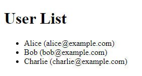

## React домашнее задание 20

### Задание

**Создадим простое React-приложение, которое отображает список пользователей и их информацию, используя хук `useSelector` для получения данных из состояния Redux.**

1. Создайте новый React-проект.

- Используйте `create-react-app` для создания нового проекта.
- Перейдите в созданный проект.

2. Установите зависимости.

- Установите `redux`, `@reduxjs/toolkit` и `react-redux`.

3. Создайте хранилище (store) Redux.

- Создайте файл `store.js`.
- Настройте и экспортируйте хранилище Redux, используя `configureStore` из `@reduxjs/toolkit`.

4. Создайте срез состояния для пользователей.

- Создайте файл `userSlice.js`.
- Определите начальное состояние, содержащее массив пользователей.
- Используйте `createSlice` для создания среза состояния с именем `users` и экспортируйте редюсер.

5. Подключите хранилище к вашему приложению.

- В файле `index.js` оберните ваше приложение в `Provider` из `react-redux` и передайте ему хранилище.

6. Создайте компонент для отображения списка пользователей.

- Создайте файл `UserList.js`.
- Используйте `useSelector` для извлечения массива пользователей из состояния.
- Отобразите список пользователей в виде списка (например, `ul` и `li`).

7. Добавьте компонент `UserList` в ваше приложение.

- Импортируйте и используйте компонент `UserList` в вашем `App.js`.

8. Проверка

- Запустите приложение и убедитесь, что список пользователей отображается корректно.

